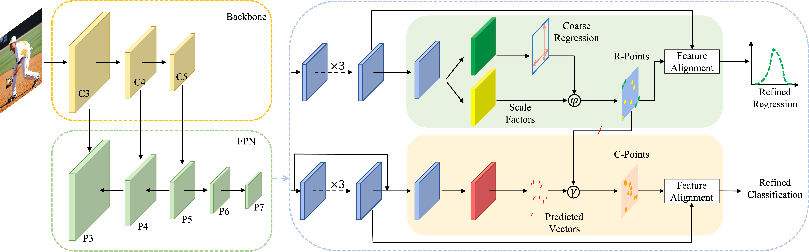

# Rethinking the Misalignment Problem in Dense Object Detection

## Introduction


Object detection aims to localize and classify the objects in a given image, and these two tasks are sensitive to different object regions. Therefore, some locations predict high-quality bounding boxes but low classification scores, and some locations are quite the opposite. A misalignment exists between the two tasks, and their features are spatially entangled. In order to solve the misalignment problem, we propose a plug-in Spatial-disentangled and Task-aligned operator (SALT). By predicting two task-aware point sets that are located in each task’s sensitive regions, SALT can reassign features from those regions and align them to the corresponding anchor point. Therefore, features for the two tasks are spatially aligned and disentangled. To minimize the difference between the two regression stages, we propose a Self-distillation regression (SDR) loss that can transfer knowledge from the refined regression results to the coarse regression results. On the basis of SALT and SDR loss, we propose SALT-Net, which explicitly exploits task-aligned point-set features for accurate detection results. Extensive experiments on the MS-COCO dataset show that our proposed methods can consistently boost different  state-of-the-art dense detectors by ∼2 AP. Notably, our best single scale model achieves 51.4 AP on the MS-COCO test-dev.

[arXiv](https://arxiv.org/abs/2108.12176)




## Installation
```
conda env create -f salt.yaml
```

Please refer to [INSTALL.md](https://github.com/open-mmlab/mmdetection) for installation and dataset preparation.

## Get Started

Please see [GETTING_STARTED.md](docs/get_started.md) for the basic usage of MMDetection.

## Train

```python
# assume that you are under the root directory of this project,
# and you have activated your virtual environment if needed.
# and with COCO dataset in 'data/coco/'

./tools/dist_train.sh configs/salt/salt_r50_fpn_2x.py 8 --validate
```

## Inference

```python
./tools/dist_test.sh configs/salt/salt_r50_fpn_2x.py work_dirs/salt_r50_fpn_2x/epoch_24.pth 8 --eval bbox
```

## Models

All models are trained with 16 images in a mini-batch with 8 GPUs.

Model | Multi-scale training | AP (minival) | AP (test-dev) 
--- |:---:|:---:|:---:
salt_R_50_FPN_1x              | No  | 42.5 | - 
salt_R_50_FPN_2x              | Yes | 45.8 | 46.0
salt_X_101_dcnv2_2_FPN_2x       | Yes | 49.5 | 49.8 
salt_X_101_dcnv2_FPN_2x       | Yes | 49.7 | 50.2
salt_R2_101_dcnv2_2_FPN_2x      | Yes | 50.7 | 51.1 
salt_R2_101_dcnv2_FPN_2x      | Yes | 51.1 | 51.4 

[1] *The numbers reported here are based on new experimental trial data, which may differ slightly from the figures presented in the original paper.* \
[2] *All results are obtained with a single model and without any test time data augmentation such as multi-scale, flipping and etc..* \

## BibTeX

```
@article{yang2021rethinking,
  title={Rethinking the Misalignment Problem in Dense Object Detection},
  author={Yang, Yang and Li, Min and Meng, Bo and Ren, Junxing and Sun, Degang and Huang, Zihao},
  journal={arXiv preprint arXiv:2108.12176},
  year={2021}
}
```


